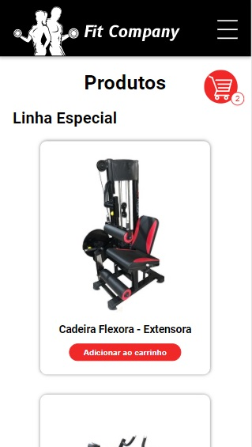
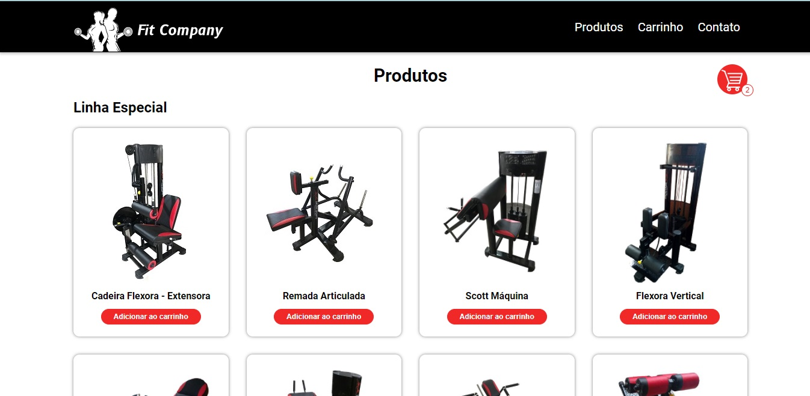
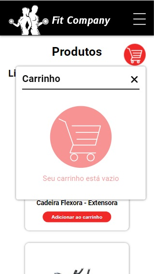
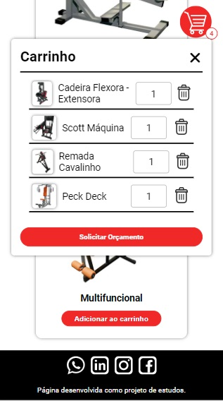
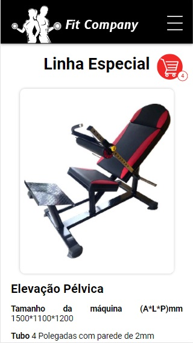
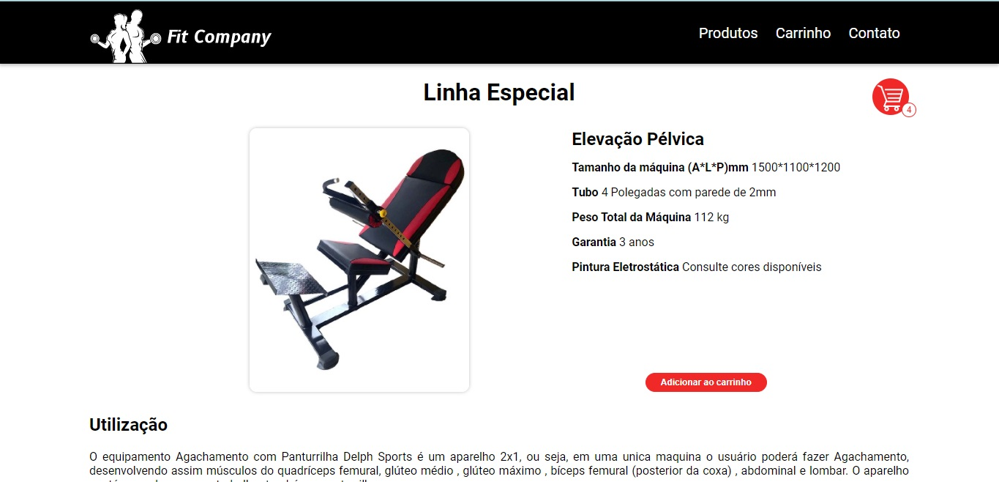
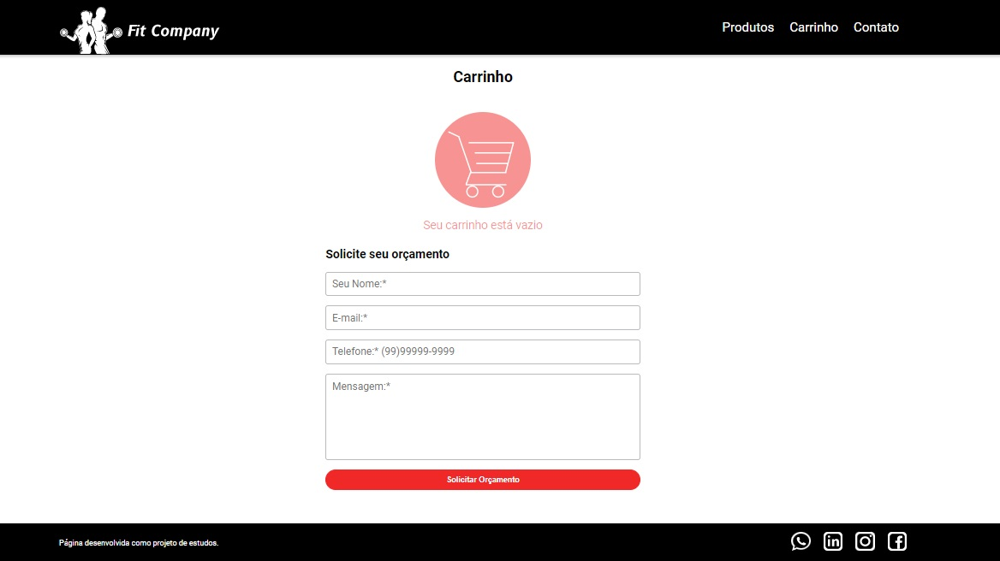
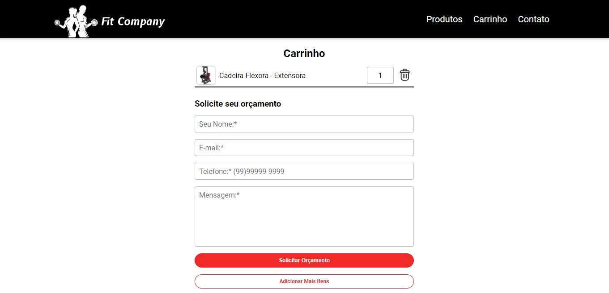

# Projeto 1 - FIT-COMPANY

Este projeto foi desenvolvido como projeto de estudos no Curso de Full Stack do Instituto INFNET.

## 🚀 Enunciado do Projeto

Você deverá escolher um problema da vida real para resolver através de um site/aplicação web. Uma dica é escolher algo relacionado ao seu trabalho ou sobre um assunto que te interessa para te manter motivado!

A solução que você vai desenvolver deve seguir os seguintes requisitos:

- Dev ser desenvolvida utilizando HTML, CSS e Javascript;
- Deve listar pelo menos uma informação dinamicamente;
- Deve salvar pelo menos uma informação no navegador do usuário;
- Integração com algum meio de comunicação (WhatsApp, e-mail, telefone).

## 🛠️ Construído com

Este projeto foi desenvolvido com **HTML**, **CSS** e **JAVASCRIPT** puros.

## 🖇️ Inspiração:

* [DELPHSPORTS](https://delphsports.com.br/) - Empresa em que minha esposa trabalha e serviu de inspieração para o tema escolhido. Utilizei fotos disponíveis na página.
* [TZ-FITNESS](https://www.tzfit.com/) - Usei como base de ideias de listar os produtos em tela, "carrinho" e página de solicitar orçamento.
* [B3](https://www.b3.com.br/pt_br/) - A bolsa de valores de São Paulo me inspirou a fazer o menu.

## 📌 Link do site postado

[https://fit-company.netlify.app/](https://fit-company.netlify.app/).

O site está hospedado na plataforma [netlify](https://www.netlify.com/)

## 📸 FOTOS DO PROJETO

**INDEX MOBILE**

**INDEX DESKTOP**

**CARRINHO VAZIO**

**CARRINHO COM PRODUTOS**

**PÁGINA DE DESCRUÇÃO DO PRODUTO - MOBILE**

**PÁGINA DE DESCRUÇÃO DO PRODUTO - DESKTOP**

**PÁGINA SOLICITAR ORÇAMENTO - CARRINHO VAZIO**

**PÁGINA SOLICITAR ORÇAMENTO - CARRINHO COM PRODUTOS**

---
Desenvovido por [André Luiz da Cunha](https://github.com/Andrecunha10/) 😊